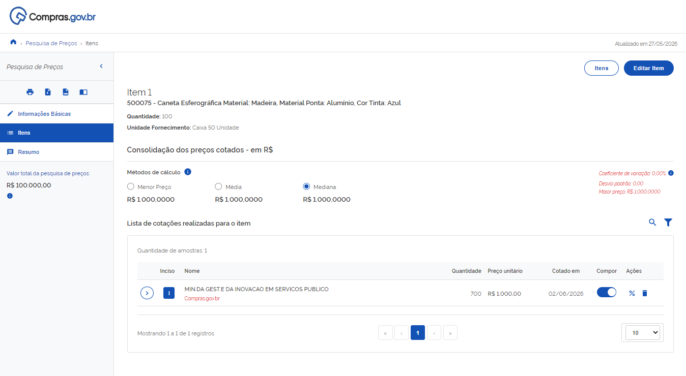
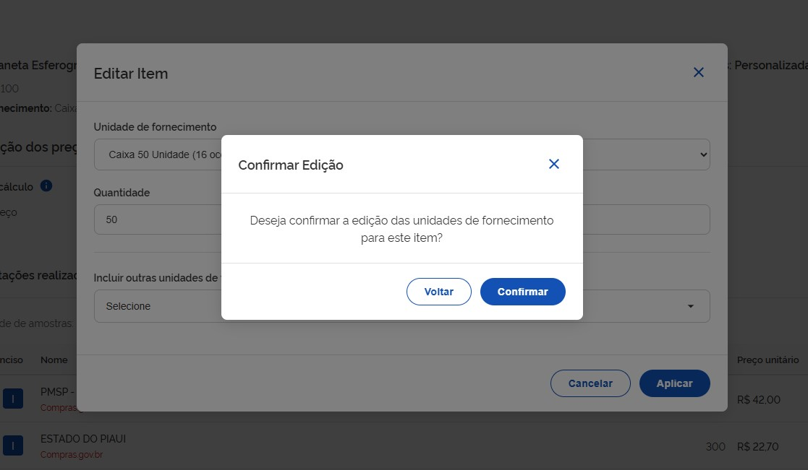

# EDIÇÃO E GESTÃO DE COTAÇÕES

**Passo 11:** Caso deseje alterar a pesquisa, clique em “Editar item” (ícone de lápis) ou em “Excluir Itens” (ícone de lixeira vermelha).

**Passo 12:** Após clicar em “Editar item”, abrirá a tela de edição. No topo da página, o sistema exibe as informações oficiais do catálogo do sistema Compras.gov.br (CATMAT para materiais ou CATSER para serviços) a respeito do item selecionado:

* **Descrição do Item:** Mostra o código (CATMAT ou CATSER) e a descrição padronizada (*Ex.: 500075 - Caneta Esferográfica Material: Madeira*).
* **Quantidade e Unidade de Fornecimento:** Indica a quantidade estipulada para a contratação e como o item é fornecido (*Ex.: Caixa 50 Unidade*).

**Passo 13:** Faça as alterações necessárias e clique em “Aplicar”.

**Passo 14:** Confirme a alteração do item.

Pronto, a cotação para aquele item foi atualizada! Para atualizar os demais itens, basta seguir novamente as instruções dos Passos 11 e 12.

---

## Indicadores Estatísticos e Painel de Controle

O Pesquisa de Preços Lite exibe indicadores em tempo real para análise dos valores encontrados:

* **Métodos de Cálculo:** Permite visualizar e alternar o critério de obtenção do preço estimado entre **Menor Preço**, **Média** ou **Mediana**. O método selecionado influenciará diretamente no valor de referência calculado pelo sistema.
* **Painel de Controle Estatístico:** Localizado à direita, apresenta o **Coeficiente de Variação**, o **Desvio Padrão** e o **Maior Preço** encontrado na amostra, servindo de parâmetro para analisar a homogeneidade e a segurança dos dados.

---

## Detalhamento das Contratações Públicas

O sistema apresenta a relação das contratações públicas que foram selecionadas para compor os preços. Ao expandir o registro na seção “Lista de cotações realizadas para o item”, o usuário tem acesso completo às informações da compra, incluindo:

* Número do processo;
* Modalidade de contratação (*Ex.: Dispensa*);
* Dados do fornecedor e marca do produto;
* Critério de julgamento.

!!! warning "Atenção"
    É possível gerenciar as contratações que compõem a pesquisa de preços:
    
    * **Coluna Compor:** Permite ativar ou desativar uma cotação específica. Quando a opção estiver desativada, o valor é excluído dos cálculos estatísticos.
    * **Coluna Ações:** O ícone de lixeira exclui definitivamente o registro da lista do item.

  🖨️ Imprimir ou baixar esta página
  </button>

