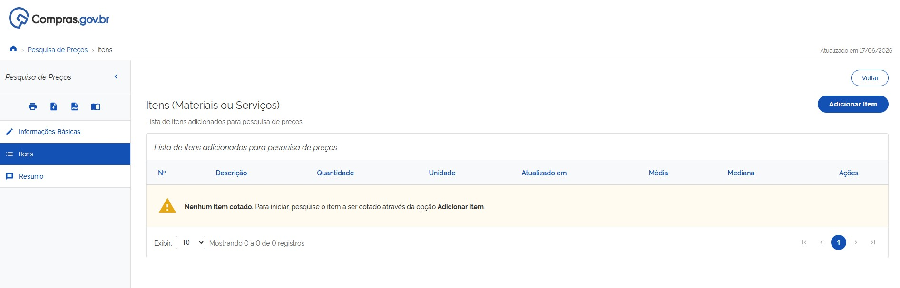
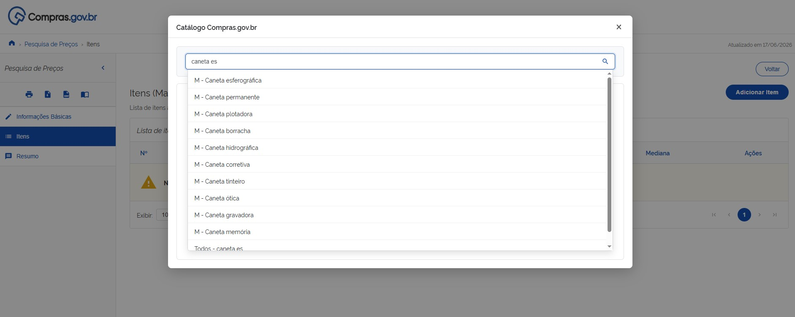
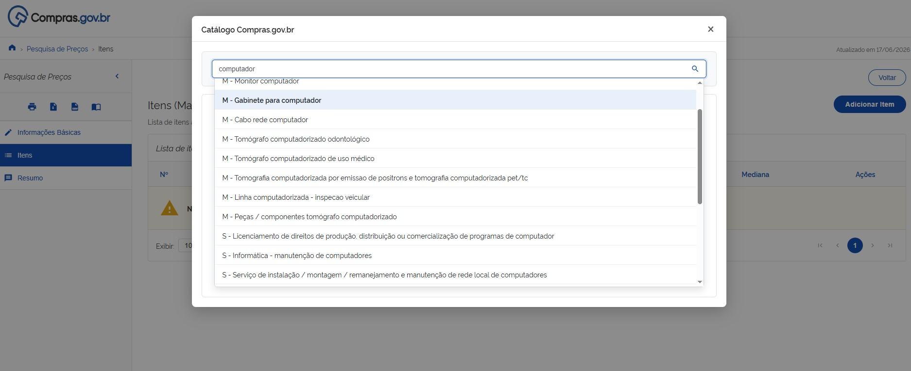
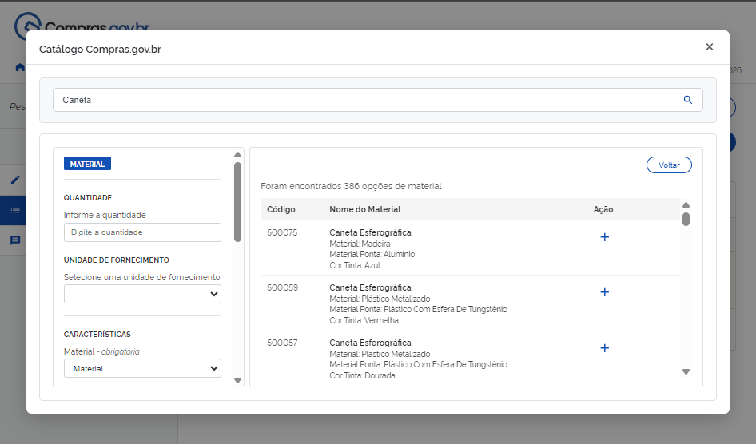

 Tamanho do texto:
 <button onclick="diminuirFonte()" title="Diminuir texto" style="padding: 6px 12px; font-weight: bold; cursor: pointer; border: 1px solid #ccc; border-radius: 4px; background: #f8f9fa;">A-</button>
 <button onclick="resetarFonte()" title="Tamanho normal" style="padding: 6px 12px; font-weight: bold; cursor: pointer; border: 1px solid #ccc; border-radius: 4px; background: #f8f9fa;">A</button>
 <button onclick="aumentarFonte()" title="Aumentar texto" style="padding: 6px 12px; font-weight: bold; cursor: pointer; border: 1px solid #ccc; border-radius: 4px; background: #f8f9fa;">A+</button>
 
 <button onclick="window.print()" style="background-color: #0056b3; color: white; padding: 6px 16px; border: none; border-radius: 5px; font-size: 14px; cursor: pointer; box-shadow: 0 2px 4px rgba(0,0,0,0.2); margin-left: 10px;">
 🖨️ Imprimir ou baixar esta página
 </button>

# ACESSO E AUTENTICAÇÃO NO PESQUISA DE PREÇOS LITE

**Passo 1:** Acesse o portal de compras do governo federal: [https://www.compras.gov.br](https://www.compras.gov.br).

**Passo 2:** No canto superior esquerdo, localize o ícone com três linhas.

**Passo 3:** Ao clicar, será exibido um menu lateral. Nele, arraste o cursor até a opção “Sistemas”, depois “Compras.gov.br” e, em seguida, “Pesquisa de Preços”.

**Passo 4:** Na página do Pesquisa de Preços, clique no botão “Pesquisa de Preços Lite”.

**Passo 5:** Caso deseje recuperar pesquisas anteriores ou garantir que sua nova consulta fique salva, clique em "Entrar com GOV.BR" no canto superior direito e faça a autenticação com seu CPF e senha.

**Passo 6 (Recuperação):** Após o login, a página inicial exibirá a lista "Minhas Pesquisas". Para recuperar uma consulta salva anteriormente e continuar a edição ou emitir relatórios, localize a pesquisa desejada e clique no ícone de "Abrir/Visualizar" (ou no título da pesquisa).

# ELABORAÇÃO DA PESQUISA E ADIÇÃO DE ITENS

**Passo 7:** Preencha as informações básicas da consulta, como título e observações, e clique em “Itens”.

**Passo 8:** Na opção “Itens”, clique em “Adicionar Item” para incluir o material ou serviço que deseja pesquisar.

**Passo 9:** No campo de texto, descreva de forma resumida o item que deseja pesquisar e selecione a opção mais adequada: **Material** ou **Serviço**.

!!! note "Nota"
    O sistema mostra as opções do catálogo do Compras.gov.br. Os itens que aparecem com a letra **M** antes do nome correspondem aos materiais e, aqueles que aparecem com a letra **S**, são serviços.
    
    *Exemplo:* Ao escrever "Computador" (Material), a lista exibirá `M - Computador`. Caso escreva "Manutenção de Computador" (Serviço), o sistema exibirá `S - Manutenção de Computador`.

**Passo 10:** No painel de consulta, selecione o item que melhor atende ao que deseja pesquisar, assim como a quantidade, a unidade de fornecimento e as características necessárias para refinamento da pesquisa. Após identificar o item e preencher os campos de quantidade e unidade de fornecimento, clique na opção **“+”** para incluir o item na lista de pesquisa.

!!! note "Nota"
    Caso deseje iniciar uma pesquisa do zero (com ou sem login), clique no botão "Nova Pesquisa" e siga para os passos seguintes.

    # CONVOCAÇÃO DE CONTRATAÇÃO DE REMANESCENTES PELAS CONDIÇÕES DO VENDEDOR

O processo de convocação de remanescentes começa pela oportunidade de assumir o contrato nas mesmas condições do fornecedor. Para manifestar se aceita ou assumir o contrato pelas condições do vencedor, siga as instruções abaixo:

**Passo 01:** No cabeçalho do campo proposta, será indicado o prazo para manifestação de interesse de fornecer pelas condições do vencedor. Revise as informações sobre as condições da contratação e selecione a opção desejada.

Confirme sua opção.

**Passo 02:** Durante o prazo de manifestação indicado, você poderá alterar sua opção. Selecione a nova opção.

Confirme.

Quando o prazo do processo finalizar para todos os fornecedores que participaram do processo se manifestarem, o agente de contratação partirá para a etapa de habilitação e julgamento dessa convocação de remanescentes. 

**Passo 03:** Acesse o item em convocação de remanescentes selecionando a opção “Operar item”.

Para visualizar quais documentos foram solicitados, acesse a seção “Anexos”.

Leia a justificativa e o conteúdo da solicitação e encaminhe os documentos necessários. Para isso, leia os avisos de sistema e declare ciência.

Anexe todos os arquivos clicando no local indicado ou arrastando os arquivos para essa área. Finalize o carregamento de todos os documentos e clique em “Encerrar envio de anexos”.

**Passo 04:** Para visualizar e responder as mensagens encaminhadas pelo agente de contratação responsável, selecione a seção “Chat”.

Essa área serve para comunicação entre as partes, caso haja dúvidas sobre o processo. Preencha a mensagem desejada e clique em “Enviar” para encaminhá-la ao agente de contratação.

**Passo 05:** Caso a documentação da proposta de fornecimento não atenda aos requisitos de edital, o fornecedor será desclassificado. Assim, ficará na tela a indicação “Classificação na convocação de remanescente: Desclassificado”.

O fornecedor não estará apto a participar novamente desta convocação de remanescente enquanto o status de “Desclassificado” persistir.

!!! warning "Atenção"
    Recursos referentes à desclassificação deverão ser encaminhados diretamente ao órgão contratante.

**Passo 06:** Caso a documentação de habilitação não atenda aos requisitos de edital, o fornecedor será inabilitado. Assim, ficará na tela a indicação “Classificação na convocação de remanescente: Inabilitado”.

O fornecedor não estará apto a participar novamente desta convocação de remanescente enquanto o status de “Inabilitado” persistir.

!!! warning "Atenção"
    Recursos referentes à desclassificação deverão ser encaminhados diretamente ao órgão contratante.

**Passo 07:** Caso toda a documentação apresentada esteja de acordo com as exigências de edital, o fornecedor será aceito para fornecimento de remanescente contratual. Assim, ficará na tela a indicação “Classificação na convocação de remanescente: Aceito e habilitado”.

**Passo 08:** Para a formalizar o processo, o agente de contratação encerrará a convocação de remanescentes. Assim, ficará na tela a indicação “Situação: Encerrada”.

